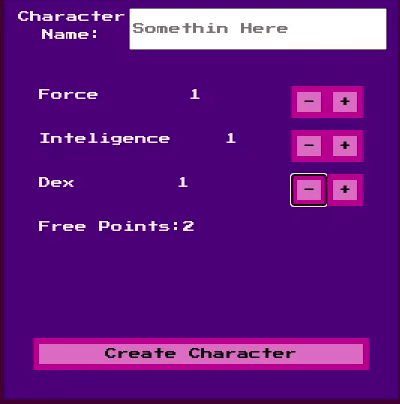
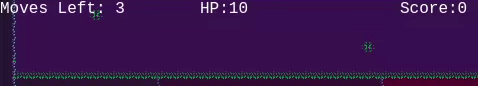
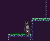
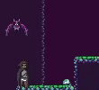
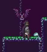
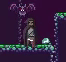

# Game Project

## Summary

- [Project Info](##About)
- [Getting Started](##Getting-Started)
- [Details](##Details)

## About

### Introduction

Project Developed Using JavaScript.  
It's a platform game made in Phaser 3, it aims to be a turn-based rpg and is still under development.
The concept is very basic: Move, end turn, jump and attack. The player has atributes and stats but 
is still being implemented.

### Live Version

[Here](https://bats-and-caves.herokuapp.com/dist/)

### Future Updates

* The future updates will be displayed when production starts.

## Getting Started

### How to Play

The game is hosted on heroku, so to play just click [here](https://bats-and-caves.herokuapp.com/dist/).

#### System

The game is turn-based, and each player will have it's turn to make a move/attack/interact.  
When creating a new character, the player will have to choose between 3 Stats:  

- **Force**: Increase both player damage and defense.
- **Intelligence**: Increase the player Xp gained.
- **Dex**: Increase the number of moves the player can do in a turn.

Since the game is under development, more features will be released.

#### HUD

The main menu has 4 entries:
* **New Game** Create a new character
* **Load Game** Loads an pre-created character
* **Instructions** Leads to this page
* **Credits** Leads to credits screen

- In game there is informations about the player on the top.  

#### Movement

- Use WASD to move, and ENTER to end the turn.  

- If the move is invalid (like trying to move where there is a wall or trying to attack while in the air)  
the character will blink white.  

#### Combat

- If you are near an enemy, use SPACE to attack him. The confirmation of the attack will make the enemy blink WHITE.  

- When your turn ends it's the enemy time to make a move. If he gets close enough it will attack you.  
If he succeed, your character will blink RED and you will take some damage.  
 

- If your health reaches 0, you will die and the game will end.  

### To Make Changes

Please, make changes only to the src folder.  
If you don't have webpack installed on your local machine, follow the instalation
instructions:
* [Webpack Install Instructions](https://webpack.js.org/guides/getting-started/)

## Details

### Built With

* JavaScript
* Node.js
* [Webpack](https://webpack.js.org/)
* [Phaser 3](https://phaser.io/phaser3)

### Contributing

Pull requests and contributions are all welcome, for any aditional feedback mail to heflerdev@gmail.com

### Author

* **Alex Hefler** - *Initial work* - [HeflerDev](https://github.com/heflerdev)

### License

This project is licensed under the MIT License

